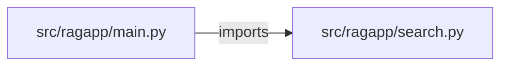

# pdf-rag-assistant — project architecture

[README](README.md) · [Interview questions and answers](INTERVIEW_QA.md)

## Purpose and scope

PDF text → chunk → retrieve → answer + citation. Local hashed overlap stands in for embeddings.

This document describes files and symbols in this checkout. Deployment templates and statements in the original overview are distinguished from a verified running environment.

## Component diagram



For Python repositories, arrows show resolved local imports, not network calls or deployment order. Otherwise the diagram is a repository component map; containment arrows do not assert runtime integration.

## Components and responsibilities

| Component | Responsibility |
| --- | --- |
| [`src/ragapp/main.py`](src/ragapp/main.py) | HTTP handlers: `GET /healthz`, `POST /ask` |
| [`src/ragapp/search.py`](src/ragapp/search.py) | Functions: `tokens`, `bm25`, `answer` |
| [`requirements.txt`](requirements.txt) | Implementation or supporting configuration |
| [`tests/test_rag.py`](tests/test_rag.py) | Executable checks and regression examples |
| [`.github/workflows/ci.yml`](.github/workflows/ci.yml) | GitHub Actions job definitions |
| [`README.md`](README.md) | Project explanations or operating notes |

## Request interface

| Method and path | Handler | Source |
| --- | --- | --- |
| `GET /healthz` | `healthz` | [`src/ragapp/main.py`](src/ragapp/main.py#L6) |
| `POST /ask` | `ask` | [`src/ragapp/main.py`](src/ragapp/main.py#L10) |

The table lists literal route decorators found in the inspected Python modules. Router prefixes and middleware can add behavior; check the linked handler and application setup before calling an endpoint.

## Implementation walkthrough

### `answer(question, source=None, session_id=None, tenant=None)`

Source: [`src/ragapp/search.py`](src/ragapp/search.py#L16).

Calls visible in this function: `' '.join`, `SESSIONS.setdefault`, `ValueError`, `bm25`, `history.append`, `s[0].startswith`, `sorted`, `str`, `str(question).strip`, `zip`.

```python
def answer(question, source=None, session_id=None, tenant=None):
    if not question or not str(question).strip():
        raise ValueError("question is empty")
    corpus = SOURCES
    if source:
        corpus = [s for s in corpus if s[0] == source]
        if not corpus:
            raise ValueError("unknown source")
    if tenant:
        corpus = [s for s in corpus if s[0].startswith(tenant) or tenant in s[0]]
    history = []
    if session_id:
        history = SESSIONS.setdefault(session_id, [])
        q = question + " " + " ".join(history[-3:])
    else:
        q = question
    scores = bm25(q, [t for _, t in corpus])
    ranked = sorted(({"source": n, "text": t, "score": sc} for (n, t), sc in zip(corpus, scores)), key=lambda x: -x["score"])
    best = ranked[0]
    if session_id:
        history.append(question)
    ok = best["score"] >= 1
```

The excerpt is truncated; the linked source contains the full implementation.

### `bm25(query, docs)`

Source: [`src/ragapp/search.py`](src/ragapp/search.py#L9).

Calls visible in this function: `d.count`, `scores.append`, `set`, `sum`, `tokens`.

```python
def bm25(query, docs):
    q, scores = set(tokens(query)), []
    for doc in docs:
        d = tokens(doc)
        scores.append(sum(d.count(t) for t in q))
    return scores
```

### `tokens(text)`

Source: [`src/ragapp/search.py`](src/ragapp/search.py#L6).

Calls visible in this function: `re.findall`, `text.lower`.

```python
def tokens(text):
    return [t for t in re.findall(r"[a-z0-9]+", text.lower()) if t not in STOP]
```

## Validation and failure paths

| Explicit exception | Source |
| --- | --- |
| `HTTPException(422, str(exc))` | [`src/ragapp/main.py`](src/ragapp/main.py#L14) |
| `ValueError('question is empty')` | [`src/ragapp/search.py`](src/ragapp/search.py#L18) |
| `ValueError('unknown source')` | [`src/ragapp/search.py`](src/ragapp/search.py#L23) |

These are explicit exceptions in the inspected source, rather than a claim that every failure is handled. Follow the calling handler to see whether the exception becomes an HTTP response or propagates.

## Data and state

- [`src/ragapp/search.py`](src/ragapp/search.py) defines module-level containers: `STOP`, `SOURCES`, `SESSIONS`.

Module-level dictionaries/lists live in a Python process. They can be fixtures or mutable state; inspect writes before treating them as persistent storage. A production extension would need to define persistence and concurrency behavior explicitly.

## Data flow and design decisions

### What is the input-to-output contract of `answer`

In [`src/ragapp/search.py`](src/ragapp/search.py#L16), `answer(question, source=None, session_id=None, tenant=None)` receives the inputs. The function computes these intermediate values:

- `corpus = SOURCES`
- `history = []`
- `scores = bm25(q, [t for _, t in corpus])`
- `ranked = sorted(({'source': n, 'text': t, 'score': sc} for (n, t), sc in zip(corpus, scores)), key=lambda x: -x['score'])`
- `best = ranked[0]`
- `ok = best['score'] >= 1`

Its result is defined by:

- `{'answered': ok, 'answer': best['text'] if ok else 'No passage shares enough terms.', 'citation': best['source'] if ok else None, 'passages': ranked[:5]}`

### Which decision rules or boundary conditions should an interviewer challenge

The implementation in [`src/ragapp/search.py`](src/ragapp/search.py#L16) branches on:

- `not question or not str(question).strip()`
- `source`
- `tenant`
- `session_id`
- `session_id`
- `not corpus`

A useful extension is a table-driven test that covers each condition just below, at, and above its boundary where applicable. These expressions are the current rules; changing them changes behavior and should be justified by the project’s acceptance criteria.

## Setup and verification

The following commands are derived from the checked-in dependency/test contracts. Execute them from the repository root; the block prepares a local environment, not a cloud deployment.

```bash
python3 -m venv .venv
source .venv/bin/activate
python -m pip install -r requirements.txt
python -m pytest -q
```

Python dependencies: [`requirements.txt`](requirements.txt).

Test entry points: [`tests/test_rag.py`](tests/test_rag.py).

Automation definitions: [`.github/workflows/ci.yml`](.github/workflows/ci.yml). Read their triggers and job steps to determine what CI actually runs.

## Operating boundaries and design review

Before turning this checkout into a customer deployment, establish the input contract, data ownership, access controls, failure response, evaluation criteria, and rollback owner. Repository fixtures and unit tests demonstrate local behavior; they do not establish throughput, uptime, compliance, or business impact.

A useful architecture review starts with the linked implementation: identify where input enters, where a decision is made, which state can change, and which external dependency can fail. Add a deployment view only for infrastructure that is actually configured and exercised.
